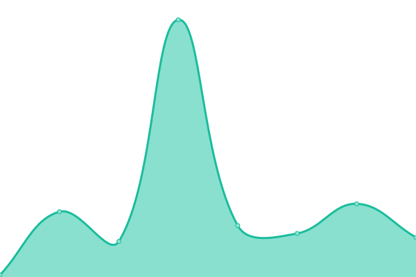

# [📈 Live Status](https://discord-creator.github.io/upptime): <!--live status--> **🟥 Complete outage**

This repository contains the open-source uptime monitor and status page for [Discord](https://discord-creator.github.io/upptime), powered by [Upptime](https://github.com/upptime/upptime).

With [Upptime](https://upptime.js.org), you can get your own unlimited and free uptime monitor and status page, powered entirely by a GitHub repository. We use [Issues](https://github.com/discord-creator/upptime/issues) as incident reports, [Actions](https://github.com/discord-creator/upptime/actions) as uptime monitors, and [Pages](https://discord-creator.github.io/upptime) for the status page.

<!--start: status pages-->
<!-- This summary is generated by Upptime (https://github.com/upptime/upptime) -->
<!-- Do not edit this manually, your changes will be overwritten -->
<!-- prettier-ignore -->
| URL | Status | History | Response Time | Uptime |
| --- | ------ | ------- | ------------- | ------ |
|  MonitoRSS-Ambler | 🟥 Down | [monito-rss-ambler.yml](https://github.com/discord-creator/upptime/commits/HEAD/history/monito-rss-ambler.yml) | 

 257ms
     
 | 

<a href="https://discord-creator.github.io/upptime/history/monito-rss-ambler">0.00%</a>
    

|  MonitoRSS-Cord | 🟥 Down | [monito-rss-cord.yml](https://github.com/discord-creator/upptime/commits/HEAD/history/monito-rss-cord.yml) | 

 0ms
     
 | 

<a href="https://discord-creator.github.io/upptime/history/monito-rss-cord">0.00%</a>
    

|  MonitoRSS-Music | 🟥 Down | [monito-rss-music.yml](https://github.com/discord-creator/upptime/commits/HEAD/history/monito-rss-music.yml) | 

 0ms
     
 | 

<a href="https://discord-creator.github.io/upptime/history/monito-rss-music">0.00%</a>
    

|  MonitoRSS-Tech | 🟥 Down | [monito-rss-tech.yml](https://github.com/discord-creator/upptime/commits/HEAD/history/monito-rss-tech.yml) | 

 227ms
     
 | 

<a href="https://discord-creator.github.io/upptime/history/monito-rss-tech">0.00%</a>
    

|  MonitoRSS-Journalism | 🟥 Down | [monito-rss-journalism.yml](https://github.com/discord-creator/upptime/commits/HEAD/history/monito-rss-journalism.yml) | 

 14ms
     
 | 

<a href="https://discord-creator.github.io/upptime/history/monito-rss-journalism">0.00%</a>
    

<!--end: status pages-->

[**Visit our status website →**](https://discord-creator.github.io/upptime)

## 📄 License

- Powered by: [Upptime](https://github.com/upptime/upptime)
- Code: [MIT](./LICENSE) © [Discord](https://discord-creator.github.io/upptime)
- Data in the `./history` directory: [Open Database License](https://opendatacommons.org/licenses/odbl/1-0/)
